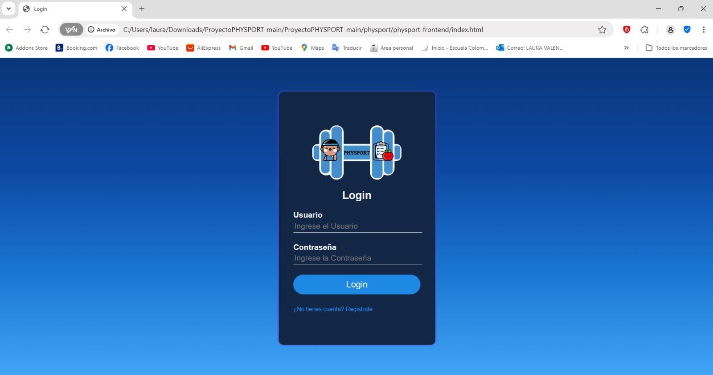

# PHYSPORT

El objetivo del siguiente proyecto  es buscar  nuevas  opciones de vida saludable por medio de rutinas básicas, para mejorar  los  hábitos  de alimentación y el  ejercicio, con  ello poder aportar un ambiente sano e ir creando ciudades inteligentes; ya que nos enfocamos en evolucionar, por esto debemos acoplarnos y adaptarnos al ambiente en que  vivimos, pero ¿Cómo impulsar a niños, niñas, hombre y mujeres a empezar una vida saludable por medio de la tecnología dejando atrás problemas en la salud física y mental en Colombia?, esta pregunta nos ha intrigado bastante hasta llegar a la solución. 
Hemos logrado hallar un camino, el cual es desarrollar una aplicación móvil para brindar servicios personalizados sobre los beneficios de una alimentación saludable y ejercicios físicos que apoyan a las personas.

## Comenzando

**Clonar el repositorio**  
git clone https://github.com/lalaro/ProyectoPHYSPORT.git

### Prerrequisitos

Se necesita instalar las siguientes herramientas:  

- Editor de código 
- Navegador
- Node.js y npm
- jQuery
- Preprocesadores CSS
- Astah 

### Instalación

Para el editor de código y el navegador pueden ser cualquiera de su preferencia.

Para Node.js y npm debe irse a https://nodejs.org/, descargar la versión 21.6.2 
y para npm la versión 10.2.4
Puede guiarse de la siguiente guia: https://kinsta.com/es/blog/como-instalar-node-js/
Y se ejecutan los siguientes comandos para verificar en Windows:
 ` node -v `
 y 
 ` npm -v `

Para jQuery debe irse a https://jquery.com/download/
Puede guiarse de la siguiente guia:  https://www.google.com/search?q=guia+para+descargar+jQuery+completamente&oq=guia+para+descargar+jQuery+completamente&gs_lcrp=EgZjaHJvbWUyCQgAEEUYORigATIHCAEQIRigAdIBCDk3NDJqMGo0qAIAsAIA&sourceid=chrome&ie=UTF-8#fpstate=ive&vld=cid:6624e9d0,vid:uWAvPHqfQ7o,st:0

Para los Preprocesadores CSS, debes revisar cuales te hacen falta y realizar la debia instalación.

Para Astah UML debe irse a https://astah.net/support/astah-uml/?submissionGuid=19d5f945-1665-494f-b91b-9d684282fd29, descargar la versión 4.0 y se ejecuta el archivo astah-uml-10_0_0-a1b9b1-jre-64bit-setup, se debe tener en cuenta pedir la licencia para la ejecución del programa.

## Despliegue

Luego de clonar el proyecto se abre el Windows PowerShell y se debe direccionar hasta el archivo index.html, como se ve en el siguiente ejemplo:

 ` cd "C:\Users\laura\Downloads\ProyectoPHYSPORT-main\ProyectoPHYSPORT-main\physport\physport-frontend" `

y luego se ejecuta el index.html 

 ` start index.html `
 
La idea es poder visualizar lo siguiente y poder navegar por la aplicación:

## Construido con

* [Node.js y npm](https://docs.npmjs.com/) - El entorno de ejecución de JavaScript y el gestor de paquetes utilizado para gestionar las dependencias del proyecto.
* [jQuery](https://jquery.com/) - La librería JavaScript que simplifica la manipulación del DOM, el manejo de eventos y las solicitudes AJAX en el frontend de la aplicación.

## Contribuyendo

Por favor, lee [CONTRIBUTING.md](https://gist.github.com/PurpleBooth/b24679402957c63ec426) para detalles sobre nuestro código de conducta y el proceso para enviarnos solicitudes de cambios (*pull requests*).

## Versionado

Usé [SemVer](http://semver.org/) para el versionado. Para las versiones disponibles, consulta los [tags en este repositorio](https://github.com/your/project/tags).

## Autores

* **Laura Valentina Rodríguez Ortegón** - *PHYSPORT* - [Repositorio](https://github.com/lalaro/ProyectoPHYSPORT.git)

## Licencia

Este proyecto está licenciado bajo la Licencia MIT - consulta el archivo [LICENSE.md](LICENSE.md) para más detalles.

## Reconocimientos

* Agradecimientos a la Escuela Colombiana de Ingeniería
* La documentación de los cursos CDA. Front-End Developer. AT&T-Google-GitHub.Coursera
* La profesora María Irma Diaz Rozo

